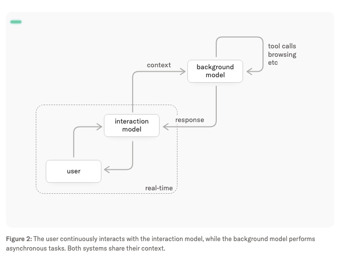

# HerOS

**HerOS - Sensation and action in every conversation.**

HerOS 的灵感来自电影《HER》。目标是做一个接近电影中 HER 形态的语音助理：既能进行有深度、自然、连续的对话，也能在需要时帮用户完成任务。

## 产品定义

- HerOS 是一个语音优先的个人助理，核心体验是“直接说话”。
- 产品形态参考电影《HER》：它应该像一个可以长期相处的智能存在，而不是传统命令式工具。
- HerOS 既要能聊得有深度，也要能把对话中的意图转化为实际任务执行。
- 桌面优先，同时支持移动端；Web 不作为第一形态。
- MVP 聚焦「实时语音交互 + 深度对话 + 异步任务执行」。

## 系统设计

HerOS 采用 Interaction Model + Background Model 架构：

- **Realtime Interaction Model**：负责实时语音交互、轻量回应、打断处理和上下文承接。
- **Background LLM/Agent**：负责复杂推理、工具调用、提醒创建和长任务。
- **Shared Context**：Interaction Model 和 Background LLM/Agent 共享上下文；后台任务结果由 Interaction Model 自然带回对话。

参考图来自 Thinking Machines Lab 的 [Interaction Models: A Scalable Approach to Human-AI Collaboration](https://thinkingmachines.ai/blog/interaction-models/) 中的 System overview。

详细架构见 [docs/system-design.md](./docs/system-design.md)。

## 功能说明

- 深度对话：支持自然、连续、有上下文的语音交流。
- 端到端语音(realtime)交互：打开后直接说话，支持打断和连续对话。
- 任务执行：从对话中理解用户意图，并交给 Background LLM/Agent 执行。
- 提醒能力（MVP）：识别提醒意图，解析时间和内容，创建提醒并语音确认。
- 无界面 CLI 先行：先验证 realtime 语音、上下文、后台任务和提醒闭环，再进入桌面界面。
- 极简界面：桌面阶段主界面只展示核心状态反馈，让注意力回到语音关系本身。
- 长期记忆：维护必要的长期记忆，让对话和任务体验具备连续性。
