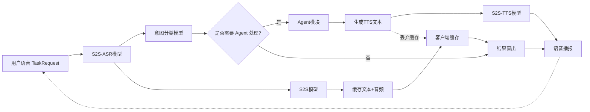

# HerOS 系统设计文档（按最新流程图）

## 1. 设计目标

HerOS 在“对话”之外，需要具备 Agent 决策能力：  
基于语音输入先做意图分类，再决定是否需要 Agent 处理，或走本地/直出路径，以保证体验和时延。

本版文档完全对齐以下流程图定义（单一事实来源）：

---

## 2. 核心流程解释

### 2.1 输入阶段

1. 客户端持续发送用户语音 `TaskRequest`（A）。
2. `S2S-ASR模型` 完成语音识别（B），输出文本语义。
3. 文本进入 `意图分类模型`（C），执行“任务/知识/闲聊/工具调用”分类。

### 2.2 决策分流

在判定节点 D：

- **需要 Agent 处理（是）**
  - 进入 G：由 Agent 进行任务/能力处理（例如提醒、工具调用、结构化决策）。
  - Agent 输出进入 E：生成可播报的 TTS 文本。
  - 再进入 F：由 `S2S-TTS模型` 转成语音。
  - 结果汇入 Z（语音播报）。

- **不需要 Agent 处理（否）**
  - 走本地直出链路 K（结果直出）。
  - K 的输入可直接来自规则结果，也可结合客户端缓存 J。
  - 结果汇入 Z（语音播报）。

### 2.3 缓存旁路（低时延保障）

流程图给出一条并行缓存链：

- B -> H -> I -> J：从 S2S 路径形成“文本+音频”缓存并落到客户端缓存。
- J -> K：在不走 Agent 路径时，K 可直接消费缓存结果做快速播报。
- E -. 丢弃缓存 -> J：当进入 Agent 处理并生成新文本路径时，旧缓存需要失效，避免播报冲突/过期内容。

当前实现补充约束（避免“先播 S2S、后判意图”）：

- ASR 开始后，S2S 回包文本/音频先进入预播放缓冲区（deferred buffer），不立即播报。
- 只有当 D 判定为 `否`（chitchat）时，才放行预播放缓冲并播放。
- 当 D 判定为 `是`（intent）时，直接丢弃预播放缓冲并切换到 Agent 结果播报。

### 2.4 闭环

Z（语音播报）完成后，系统回到 A（继续收音），形成持续对话循环。

---

## 3. 系统模块设计

### 3.1 语音输入与识别模块

- 负责采集麦克风音频并上送 `TaskRequest`
- 对接 `S2S-ASR模型`
- 输出标准化文本给意图分类

### 3.2 意图分类模块

- 输入：ASR 文本
- 输出：是否需要 Agent 处理（布尔决策 + 类别）
- 要求：低延时、可解释、可扩展标签体系

### 3.3 Agent 模块（G）

- 仅在 `D=是` 时触发
- 负责意图对应的能力处理（任务编排、工具调用、参数校验、结果组织）
- 输出 Agent 结果文本或结构化结果给 E

### 3.4 TTS文本生成模块（E）

- 仅在 `D=是` 时触发
- 接收 Agent 处理结果并生成“可直接播报”的 TTS 文本
- 触发缓存失效策略（对 J 执行丢弃或版本更新）

### 3.5 S2S-TTS模块（F）

- 输入：E 的文本
- 输出：语音流（PCM/分片）
- 与 Z 对接，保证首包时延与连续播放

### 3.6 S2S缓存链路（H/I/J）

- H：S2S 侧产出可缓存结果
- I：封装为“文本+音频”缓存对象
- J：客户端本地缓存（按会话/轮次/版本管理）

### 3.7 结果直出模块（K）

- 输入：本地策略结果 + 客户端缓存
- 适用场景：无需联网、低风险、可本地完成的请求
- 目标：最短路径播报

### 3.8 语音播报模块（Z）

- 合并 F 与 K 两路输出
- 统一播放控制（开始、打断、结束）
- 播报完成后触发下一轮采集

---

## 4. 关键设计约束

1. **单一播报出口**  
   F 与 K 必须汇聚到 Z，防止双通道同时发声。

2. **缓存一致性优先**  
   一旦进入 Agent 处理并生成 E 路径，应丢弃旧缓存（E -> J），避免旧结果覆盖新结果。

3. **分流判定前置**  
   D 必须在 S2S 播报前给出决策；决策前仅允许预缓存，不允许直出播放。

4. **直出路径最短**  
   D=否 时优先走 K，保障实时感。

---

## 5. 状态机（客户端）

- `listening`：采集并发送 TaskRequest
- `thinking`：ASR + 意图分类 + 分流决策 +（可选）Agent处理
- `speaking`：Z 播报中
- `error`：不可恢复异常

建议迁移：

- listening -> thinking -> speaking -> listening（主循环）
- thinking 中若 D=否，优先快速进入 speaking
- speaking 被打断时立即回 listening

---

## 6. 缓存设计建议（对应 I/J）

缓存对象建议：

- `utteranceId`
- `asrText`
- `ttsText`（可选）
- `audioChunks`
- `source`（S2S / Agent / Local）
- `version`
- `createdAt`
- `expiredAt`

策略建议：

- 同一 `utteranceId` 仅保留最高版本
- E 分支触发 `invalidate(utteranceId or sessionScope)`
- J -> K 读取时校验 TTL 与版本
- 增加 `deferredBuffer`（当前轮临时缓冲）：D=否 时 flush 到播放链路，D=是 时直接 drop

---

## 7. 异常与恢复

1. **ASR失败**：重试当前轮或回到 listening。
2. **分类不确定**：默认降级到“需要 Agent 处理”以保证答复质量。
3. **TTS失败（F）**：回退到 K（若有可用缓存/文本）。
4. **缓存失效竞争**：以版本号和时间戳仲裁，禁止过期结果进入 Z。
5. **播报中断**：立即停止播放，回收资源并回 listening。

---

## 8. MVP落地边界

MVP 先实现以下闭环：

1. A -> B -> C -> D 分流可用。
2. D=是：G -> E -> F -> Z 可稳定播报。
3. D=否：J -> K -> Z 低时延直出可用。
4. E -> J 的缓存丢弃策略生效。
5. Z -> A 循环稳定，不因单轮异常中断会话。

---

## 9. 工程落地与运行（与 README 对齐）

### 9.1 平台与形态

- 当前形态为桌面优先，同时支持移动端。
- 客户端技术栈：React Native + `react-native-macos` + `react-native-windows`。
- 桌面端 UI 采用竖向手机比例容器（19.5:9）以统一交互体验。

### 9.2 关键实现文件

- 意图分类：`src/core/agent/IntentClassifier.ts`
- Agent 实体：`src/core/agent/Agent.ts`
- Agent 运行时：`src/core/agent/AgentRuntime.ts`
- Agent 工作区读写与 Bootstrap：`src/core/agent/AgentWorkspace.ts`
- 分流与语音主链路：`src/core/voice/DoubaoVoiceProvider.ts`
- 音频缓存：`src/core/voice/AudioResponseCache.ts`
- 运行时状态管理：`src/hooks/useHerOSRuntime.ts`
- 主状态动画：`src/ui/components/StatusOrb.tsx`

### 9.3 本地开发命令

- `npm run start`：启动 Metro。
- `npm run macos`：运行 macOS 端。
- `npm run windows`：运行 Windows 端。
- `./start.sh`：加载 `.env.local`、重启 Metro（清缓存）并启动 macOS App。
- `npm run agent:text -- "<文本指令>"`：仅运行文本 Agent 入口，用于独立验证 Agent 能力与工具调用链。

### 9.4 配置约定

- 运行时密钥和地址放在 `.env.local`（不提交）。
- 模板文件为 `.env.example`。
- 可通过 `python3 scripts/extract_doubao_config.py` 从 `doubao_s2s/config.py` 抽取配置到本地环境文件。

### 9.5 Agent Bootstrap 文件约定

- 仓库模板文件位置：`docs/agent-bootstrap/AGENTS.md`、`docs/agent-bootstrap/SOUL.md`、`docs/agent-bootstrap/MEMORY.md`。
- 运行时文件位置：`<DocumentDirectoryPath>/agent-workspace/`（可由 `HEROS_AGENT_WORKSPACE_DIR` 覆盖）。
- 启动时由客户端自动确保三份文件存在，不存在时写入默认模板。
- 意图分类与后续 Agent 执行可读取三份文件拼接上下文；运行中产生的记忆写回运行时 `MEMORY.md`。
- `MEMORY.md` 使用结构化 JSON 数据块存储长期记忆，支持 CRUD；每条记忆至少包含 `id`、`createdAt`、`updatedAt`、`content`。

### 9.6 Agent 运行时（参考 MiniClaw 子集）

- 采用单 Agent + tool-calling 循环（最大轮次受限），不引入 session 概念。
- 工具最小集：`file_read/write/edit`、`memory_list/get/create/update/delete/search`、`system_exec`。
- `intent` 分流命中后先执行本地 Agent 工具链，再继续现有 S2S 语音回包链路。
- 不维护 session 级记忆，仅使用长期 `MEMORY.md`。
