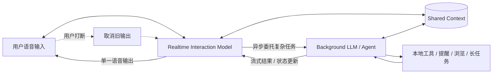

# HerOS 系统设计文档

## 1. 设计目标

HerOS 在“对话”之外，需要具备 Agent 决策和任务执行能力。MVP 采用端到端语音(realtime)模型作为 Interaction Model：它负责与用户实时共处、持续收听、即时回应、处理打断和维护共享上下文；更复杂的推理、工具调用、浏览和长任务交给下游更强的 Background LLM/Agent 异步完成。

当前实现先落地 Phase 1 无界面 CLI，用于验证 realtime 语音、共享上下文、后台任务、提醒和长期记忆闭环。本文档描述整体目标架构，并随实现进展做轻量校正。

## 2. 实现阶段

### 2.1 Phase 1: 无界面 CLI

第一阶段先做无界面 CLI，用最短路径验证核心能力：

- 建立 realtime 语音会话。
- 支持麦克风输入、语音输出、连续 VAD 监听和用户打断。
- 输出结构化事件日志，便于调试每一轮输入、后台委托、Agent 执行和播报。
- 验证提醒任务闭环：解析、必要澄清、创建、确认。
- 验证长期记忆模板和运行时工作目录初始化。

CLI 阶段不实现主界面、不实现复杂设置页、不绑定最终桌面技术栈。

CLI 运行方式见 [docs/cli-runtime.md](./cli-runtime.md)。

### 2.2 Phase 2: 桌面界面

第二阶段在 Phase 1 核心运行时通过后接入桌面客户端：

- 接入状态动画和最小设置入口。
- 接入系统权限、通知、常驻、调度和本地集成能力。
- 将 CLI 事件流映射为 UI 状态机。
- 保持同一套 Agent、提醒、记忆和 realtime 会话接口。

### 2.3 Phase 3: 移动端

第三阶段再补齐移动端：

- 复用核心运行时和 Agent 能力。
- 针对移动端补齐音频权限、通知、后台限制和连续使用体验。

## 3. 主流程

### 3.1 Thinking Machines 参考图

参考 Thinking Machines Lab 的 [Interaction Models: A Scalable Approach to Human-AI Collaboration](https://thinkingmachines.ai/blog/interaction-models/) 中的 System overview 图。原图由 HTML/SVG/CSS 绘制；仓库内保存完整渲染截图作为 PNG。

原文图注：The user continuously interacts with the interaction model, while the background model performs asynchronous tasks. Both systems share their context.

HerOS 采用同一分工：Realtime 是 Interaction Model；Background LLM/Agent 负责更复杂、更慢、更强的能力；两者共享上下文。

### 3.2 HerOS 主流程

## 4. 核心流程解释

### 4.1 输入阶段

1. 客户端采集麦克风音频并发送到 realtime 语音会话。
2. Realtime Interaction Model 持续输出文本片段、音频片段和结构化事件。
3. 当需要更复杂的推理或任务执行时，Interaction Model 把共享上下文和任务目标异步委托给 Background LLM/Agent。
4. Background LLM/Agent 执行期间，Interaction Model 继续与用户交互、接收追问、处理打断，并在合适时机把后台结果带回对话。

CLI 阶段的“客户端”是命令行运行时；桌面阶段的“客户端”是带界面的桌面应用。两者复用同一核心会话和 Agent 接口。

### 4.2 异步委托

Realtime Interaction Model 负责判断是否需要委托后台能力：

- **需要复杂能力**
  - Interaction Model 发出异步任务请求，携带共享上下文，而不是只发送孤立 query。
  - Background LLM/Agent 完成任务编排、工具调用、参数校验和结果组织。
  - MVP 的首个任务能力是提醒创建与确认。
  - 结果流式返回 Interaction Model，由它根据用户当前状态选择合适时机说出。

- **不需要复杂能力**
  - 保持在 realtime 自然回复链路中。
  - 适用于轻量对话、状态确认、低风险问答和无需工具执行的请求。
  - 回复由 realtime 会话直接输出到单一音频通道。

### 4.3 打断与失效

- 用户在系统播报时再次说话，客户端应立即停止旧音频。
- 旧的待播报文本、音频片段和过期后台结果必须失效。
- 新输入进入同一个主循环，Interaction Model 更新共享上下文，并可取消或修正后台任务。

### 4.4 闭环

语音播报完成后，系统回到收音状态，形成持续对话循环。

## 5. 系统模块设计

### 5.1 客户端语音 I/O 模块

- 负责麦克风采集、音频播放、音频焦点、权限请求和设备异常处理。
- 对 realtime 会话提供统一音频输入。
- 从单一播报出口消费音频输出。
- CLI 阶段提供命令行日志和基础按键控制；桌面阶段再接入视觉状态和系统权限引导。

### 5.2 Realtime Interaction Model 模块

- 管理 realtime 连接生命周期。
- 接收用户音频并输出文本、音频和结构化事件。
- 保持与用户的实时共处：听、说、等待、插话、打断、承接上下文。
- 判断任务是否超出即时交互能力，并异步委托 Background LLM/Agent。
- 接收后台结果并生成最终可听回复。
- 支持低时延回复、流式输出、用户打断和会话恢复。
- 不绑定特定供应商，重新实现时通过接口隔离具体服务。

### 5.3 Shared Context 模块

- 保存 Interaction Model 与 Background LLM/Agent 都可访问的上下文。
- 内容包括当前轮语音转写、用户目标、打断状态、后台任务状态、工具结果和必要长期记忆摘要。
- Background LLM/Agent 接收的是 rich context package，而不是孤立 query。
- 不额外引入独立 ASR/NLU/TTS 管线；文本和结构化事件只是 Interaction Model 的派生上下文。

### 5.4 Background LLM/Agent 模块

- 仅在 Interaction Model 异步委托时触发。
- 负责更复杂、更慢、更强的能力，例如提醒、规划、参数校验、工具调用、浏览、结构化决策和本地动作执行。
- 结果可以流式返回，Interaction Model 负责选择何时、如何把结果带回对话。
- 不引入 session 概念；运行中只使用必要上下文和长期记忆。

### 5.5 任务执行模块（MVP: 提醒）

- 解析提醒时间和内容。
- 处理缺失参数追问。
- 创建本地提醒、通知或系统日程。
- 返回明确的成功/失败确认。

### 5.6 单一语音播报出口

- 由 Realtime Interaction Model 统一编排自然回复和后台结果回复。
- 统一播放控制（开始、打断、结束）。
- 保证同一时刻只有一个输出源发声。

### 5.7 长期记忆模块

- 使用 `MEMORY.md` 保存长期记忆。
- 记忆数据采用结构化 JSON 数据块。
- 不保存密钥、令牌、密码等敏感信息。
- MVP 不实现会话级记忆。

## 6. 关键设计约束

1. **单一播报出口**  
   Realtime 自然回复与后台结果回复必须由同一个 Interaction Model 音频输出通道播放，防止双通道同时发声。

2. **打断优先**  
   用户新输入优先级高于当前播报。发生打断时，旧输出立即停止并失效。

3. **任务结果确定性**  
   提醒类任务必须给出明确确认，包括是否创建成功、提醒时间和提醒内容。

4. **共享上下文**  
   Interaction Model 与 Background LLM/Agent 共享上下文。Background LLM/Agent 不接收孤立 query，必须看到足够的对话、状态和任务背景。

5. **异步后台能力**  
   长时推理、工具调用、浏览和复杂任务必须异步执行。Interaction Model 在后台任务运行期间继续服务用户。

6. **供应商隔离**  
   端到端语音(realtime)能力需要通过接口抽象接入，避免业务逻辑绑定到单一服务。

7. **端到端语音优先**  
   不把核心链路拆回独立 ASR、NLU、TTS 管线；文本和结构化事件只能作为 Interaction Model 的派生事件和上下文接口。

8. **桌面优先**  
   架构需要优先满足桌面常驻、系统权限、通知、调度和本地集成能力。

9. **CLI 先行**  
   核心运行时必须先能在无界面 CLI 中独立工作；桌面界面只消费核心事件，不拥有业务闭环。

## 7. 状态机（客户端）

- `idle`：应用已就绪，等待语音输入。
- `listening`：采集并发送用户语音。
- `interacting`：Interaction Model 正在实时理解、轻量回复、等待用户继续说话或处理打断。
- `background_running`：Background LLM/Agent 正在异步执行任务。
- `speaking`：单一语音播报出口正在播放。
- `interrupted`：用户打断，旧输出正在取消。
- `error`：不可恢复异常。

建议迁移：

- `idle -> listening -> interacting -> speaking -> listening`
- `interacting -> background_running -> interacting -> speaking`
- `speaking -> interrupted -> listening`
- `interacting` 中若无需后台能力，应尽快进入 `speaking`
- `background_running` 期间用户仍可继续说话；Interaction Model 需要把新信息写入 Shared Context，必要时取消或修正后台任务。

## 8. 事件设计建议

Interaction Model、Shared Context 和 Background LLM/Agent 之间建议使用结构化事件：

- `input_audio.started`
- `input_audio.completed`
- `transcript.delta`
- `transcript.completed`
- `interaction.context_updated`
- `background_task.requested`
- `background_task.started`
- `background_task.progress`
- `background_task.needs_clarification`
- `background_task.completed`
- `background_task.cancelled`
- `agent.started`
- `agent.completed`
- `tool_call.completed`
- `tool_call.failed`
- `response.audio.delta`
- `response.completed`
- `response.interrupted`
- `error`

核心字段建议：

- `turnId`
- `eventType`
- `text`
- `audioChunk`
- `backgroundTaskId`
- `toolName`
- `arguments`
- `result`
- `contextVersion`
- `createdAt`

CLI 阶段应把这些事件输出为可读日志，写入运行时 `events.ndjson`，并支持实时 follow，作为功能验收和后续 UI 状态映射的依据。

## 9. 异常与恢复

1. **麦克风权限失败**：引导用户开启权限，并保持应用可恢复。
2. **Realtime 连接失败**：重试连接；超过阈值后进入错误状态。
3. **后台任务参数不确定**：优先由 Interaction Model 追问一句简短澄清，避免错误执行任务。
4. **提醒创建失败**：语音说明失败原因，并提示可重试。
5. **播报中断**：立即停止播放，回收资源并回到 listening。
6. **后台任务超时**：取消或降级本轮任务，给出可听懂的失败反馈。

## 10. MVP 落地边界

MVP 先实现以下闭环：

1. CLI 端到端语音(realtime)链路可用：收音、理解、回复、播放、打断。
2. CLI 异步委托可用：Interaction Model 可在提醒任务时委托 Background LLM/Agent，普通轻量对话不进入后台。
3. CLI 提醒任务闭环可用：解析、必要澄清、创建、确认。
4. 单一播报出口稳定：不会出现双通道同时发声。

桌面端基础体验（权限、通知、常驻和最小设置入口）属于 Phase 2，不进入 Phase 1 CLI 验收边界。

## 11. 工程落地原则

- 先实现无界面 CLI，核心功能验收通过后再做带界面的桌面客户端。
- 先建立接口边界，再接入具体 realtime 语音服务。
- 先建立 Interaction Model、Shared Context、Background LLM/Agent 三者边界。
- 先做提醒任务的完整异步后台闭环，再扩展工具生态。
- 保持主界面克制，只暴露实时状态和必要设置。
- 运行时数据与仓库模板分离，用户数据写入本地应用数据目录。
- 所有密钥只存在本地环境或系统密钥管理中，不提交到仓库。

## 12. Agent Bootstrap 文件约定

- 仓库模板文件位置：`docs/agent-bootstrap/AGENTS.md`、`docs/agent-bootstrap/SOUL.md`、`docs/agent-bootstrap/MEMORY.md`。
- 运行时文件位置：由客户端应用数据目录决定，开发环境可支持覆盖。
- 启动时由客户端自动确保三份文件存在，不存在时写入默认模板。
- Interaction Model 与 Background LLM/Agent 都可读取三份文件拼接上下文；运行中产生的记忆写回运行时 `MEMORY.md`。
- `MEMORY.md` 使用结构化 JSON 数据块存储长期记忆，支持 CRUD；每条记忆至少包含 `id`、`createdAt`、`updatedAt`、`content`。
